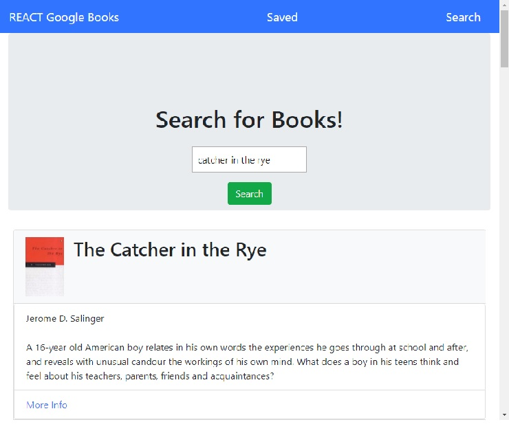

# Google Books React Search

Application is a MERN application with MVC file structure. This application uses axios to call a google API to search for books, and then the user can save the books to a MONGO database.

# Technology
<ul>
    <li>Axios - https://www.npmjs.com/package/axios</li>
    <li>Bootstrap - https://getbootstrap.com</li>
    <li>MERN
        <ul>
            <li>Mongo - https://www.mongodb.com</li>
            <li>Express - https://www.npmjs.com/package/express</li>
            <li>React - https://www.npmjs.com/package/react</li>
            <li>Node - https://nodejs.org/en/</li>
        </ul>
    </li>   
</ul>



# Requirements

In this activity, you'll create a new React-based Google Books Search app. This assignment requires you to create React components, work with helper/util functions, and utilize React lifecycle methods to query and display books based on user searches. You'll also use Node, Express and MongoDB so that users can save books to review or purchase later.

1. Start by using the 07-Ins_Mern example as a base for your application.

2. Add code to connect to a MongoDB database named `googlebooks` using the mongoose npm package.

3. Using mongoose, then create a Book schema.

4. At a minimum, books should have each of the following fields:

* `title` - Title of the book from the Google Books API

* `authors` - The books's author(s) as returned from the Google Books API

* `description` - The book's description as returned from the Google Books API

* `image` - The Book's thumbnail image as returned from the Google Books API

* `link` - The Book's information link as returned from the Google Books API

* Creating `documents` in your `books` collection similar to the following:

    ```js
    {
      authors: ["Suzanne Collins"]
      description: "Set in a dark vision of the near future, a terrifying reality TV show is taking place. Twelve boys and twelve girls are forced to appear in a live event called The Hunger Games. There is only one rule: kill or be killed. When sixteen-year-old Katniss Everdeen steps forward to take her younger sister's place in the games, she sees it as a death sentence. But Katniss has been close to death before. For her, survival is second nature."
      image: "http://books.google.com/books/content?id=sazytgAACAAJ&printsec=frontcover&img=1&zoom=1&source=gbs_api"
      link: "http://books.google.com/books?id=sazytgAACAAJ&dq=title:The+Hunger+Games&hl=&source=gbs_api"
      title: "The Hunger Games"
    }
    ```

5. Create a layout similar to the mockups displayed above. This should be a SPA (Single Page Application) that uses [`react-router-dom`](https://github.com/reactjs/react-router) to navigate, hide and show your React components without changing the route within Express.

* The layout should include at least two React Components for each page `Search` and `Saved`.

6. Add the following Express routes for your app:

* `/api/books` (get) - Should return all saved books as JSON.

* `/api/books` (post) - Will be used to save a new book to the database.

* `/api/books/:id` (delete) - Will be used to delete a book from the database by Mongo `_id`.

* `*` (get) - Will load your single HTML page in `client/build/index.html`. Make sure you have this _after_ all other routes are defined.

* Deploy your application to Heroku once complete. **You must use Create React App** and current versions of React and React-Router-Dom for this assignment.
